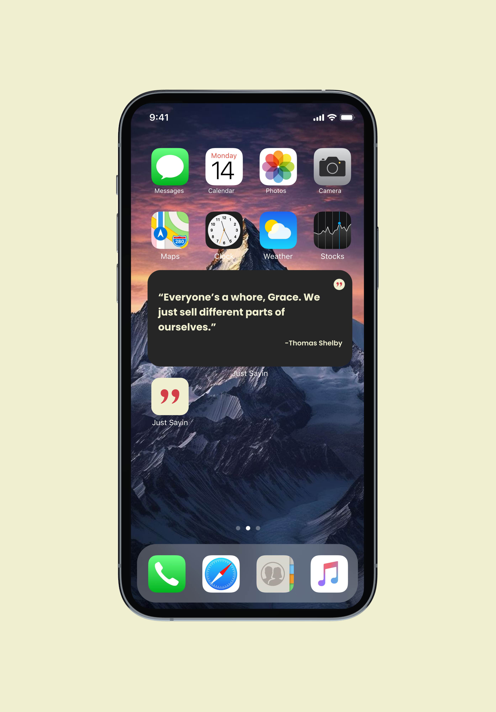

# Just Sayin - Daily Quote Generator Mobile App

## Table of Contents

- [Introduction](#introduction)
- [Live Demo](#live-demo)
- [Frameworks and Tools](#frameworks-and-tools)
- [Contributing](#contributing)
- [Credits](#credits)

## Introduction

Still under development~! JustSayin is a mobile applicaton that generates daily quotes displayed on your IOS widgets based on your categories and preferences.



## Live Demo

JustSayin is still under development! We are gonna release this app by February 2024, but if you are interested, go ahead and clone/fork the repository.

1. Navigate into `frontend/` and run React Native frontend by

```bash
npm start
```

2. Navigate into `backend/` and run NodeJS backend by

```bash
npm run dev
```

3. Navigate into `frontend/ios` then open XCode using

```bash
open frontend.xcworkspace
```

After XCode finishes loading, run the keyboard shortcut `cmd + shift+ k (⌘⌃k)` this will clean the build folder.

Then run `cmd + r (⌘r)` to rebuild the project. This will run simulator, and you will see the app running! Make sure to add our widget on the homepage for the full experience!

## Frameworks and Tools

We are using the MERN tech stack:

- **Frontend**: React Native and SwiftUI (for widgets)
- **Backend**: NodeJS
- **Database**: MongoDB

## Contributing

Contributions are what make the open source community such an amazing place to learn, inspire, and create. Any contributions you make are greatly appreciated.

1. Fork the Project
2. Create your Feature Branch (git checkout -b feature/AmazingFeature)
3. Commit your Changes (git commit -m 'Add some AmazingFeature')
4. Push to the Branch (git push origin feature/AmazingFeature)
5. Open a Pull Request

## Credits

- **Developer**: Teeranade Cheng (Win): <a href="https://www.linkedin.com/in/teeranade-cheng/" target = "_blank">LinkedIN</a>

- **Designer**: Khunanya Liu (Yaya): <a href="https://www.linkedin.com/in/khunanya-liu/" target = "_blank"> LinkedIN</a>


